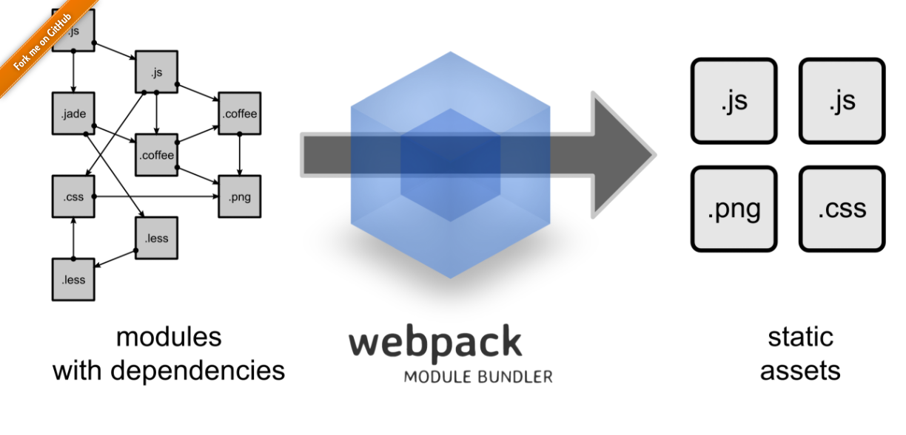

#Production-ish Server
Package Based on https://github.com/reactjs/react-router-tutorial

___

###What is this repo?
The intent of this repo is to show the simplicity of an Express static-asset server.

The Node server listens for browser requests and responds with our bundled React application. The React components are
simple in design to focus on the structure of this app. NPM serves as our task runner.Webpack is used to transpile and
bundle our Javascript.

</src>

React Router serves to route requests within the browser in a SPA ('single page app'). React Router will provide the
appropriate React components based on path based routing on the URL. The SPA is loaded once from the Express server.
All additional traffic generated by the browser app is XHR traffic routing API requests.

Please note the two npm tasks located in package.json. One is for a dev server and the other option is a simulated
production server...in this case our production server is Express -- serving our app on 8080.  You certainly could run
Express in development mode as well, but the webpack-dev-server is triggered by webpack builds to refresh with current
content.

In contrast, the local dev server is a package called webpack-dev-server. Once you start the app in dev mode,

`npm start`

the web browser will auto refresh with your changes to the transpiled, and bundled javascript file bundle.js delivered
to your browser. If you will keep your browser window open, webpack will watch your js files and refresh the browser
automatically with your changes.

___
### Setup

`npm install`

---
### Running Local

`npm start`

---
### Simulate production environment

`NODE_ENV=production npm start`